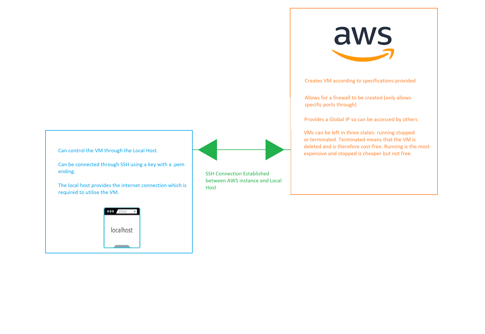
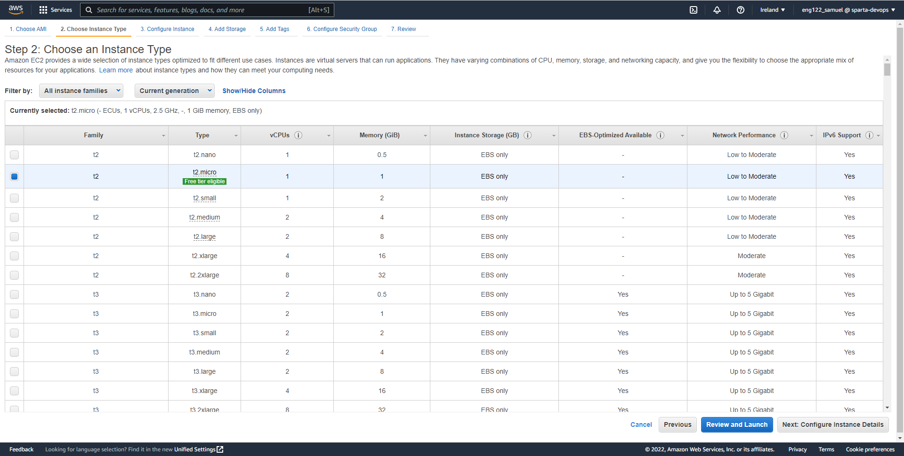
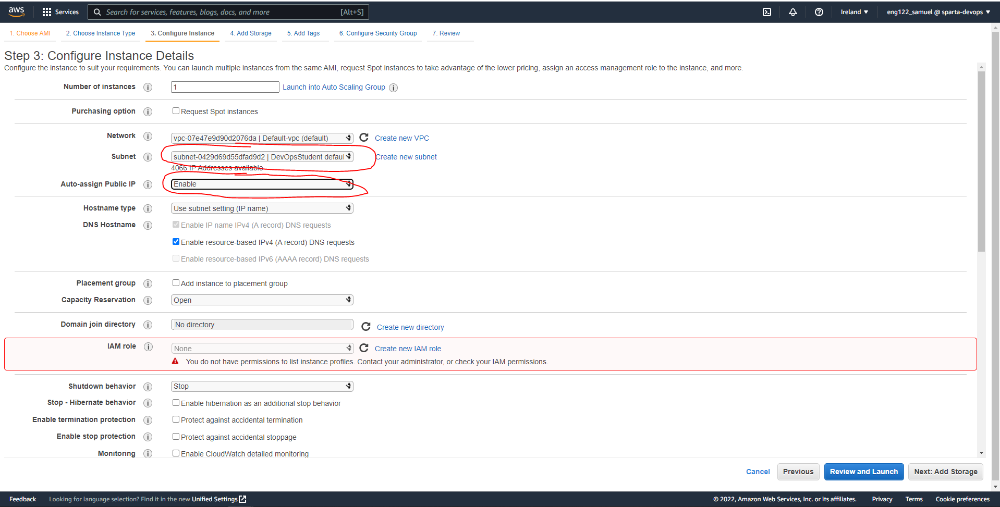
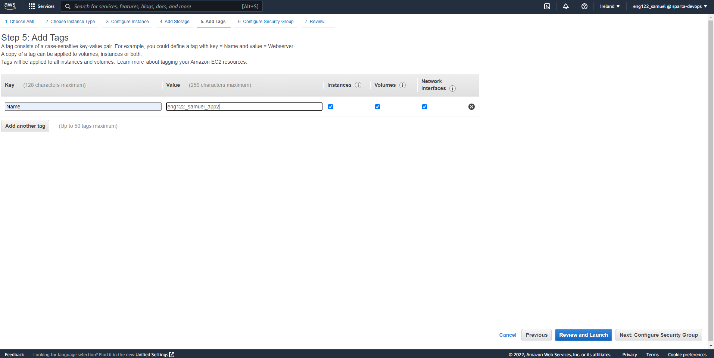
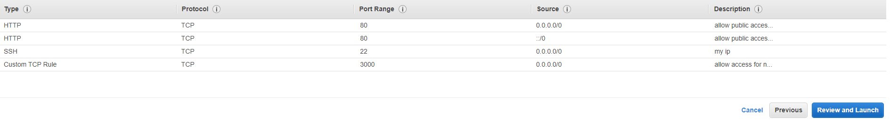
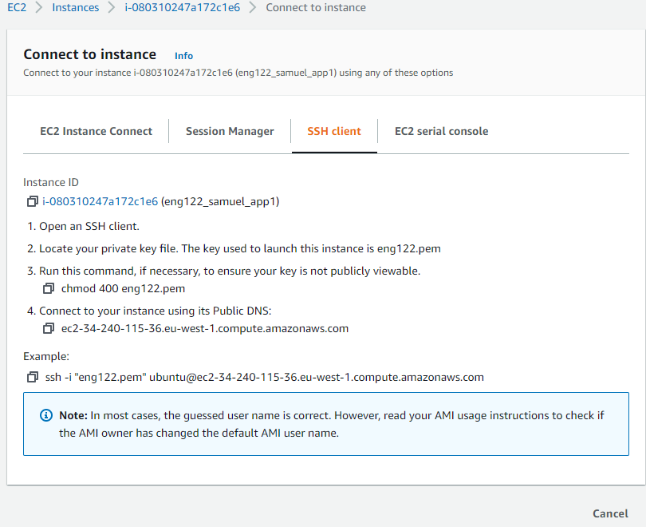
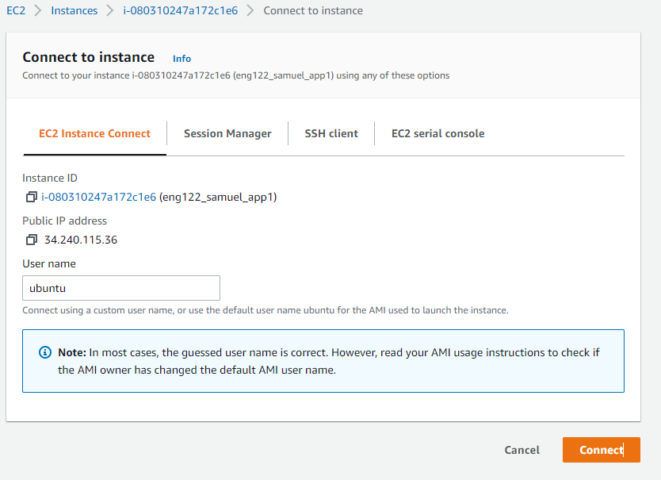
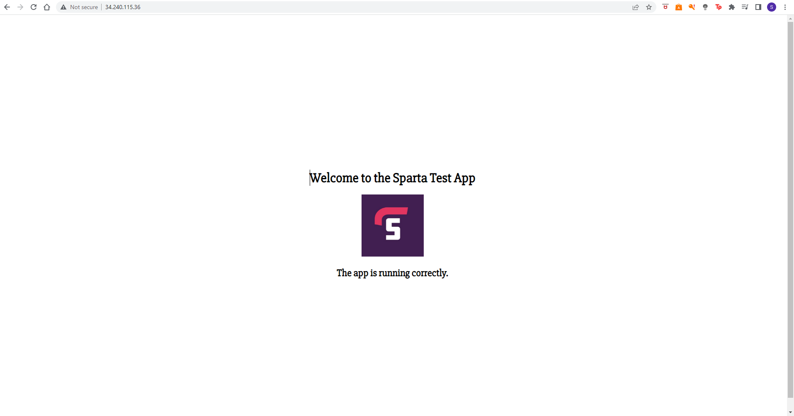
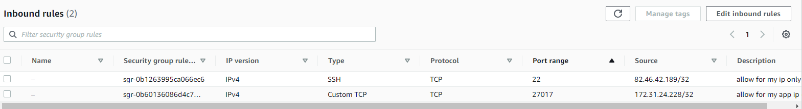
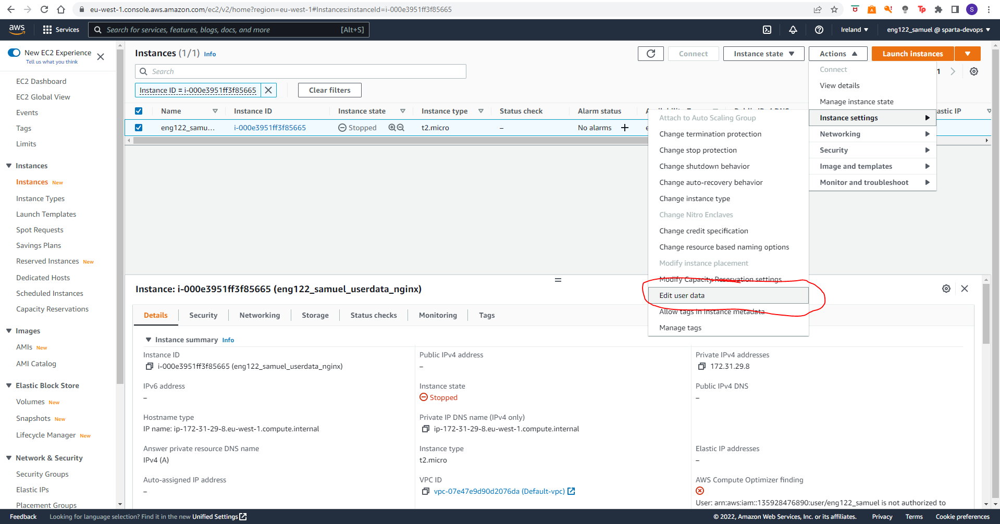

# Cloud Computing

## What is Cloud Computing?

The practice of using a network of remote servers hosted on the internet to store, manage, and process data, rather than a local server or a personal computer.

### What are the benefits of Cloud Computing?

- High speed – quick deployment
- Automatic software updates and integration CI-CD
- Efficiency and cost reduction
- Scalability
- Collaboration
- Data Loss Prevention

### What is IaaS?

- Infrastructure as a Service
- Fastest and least expensive
- Management of network, servers and data storage on the cloud 
- Examples: AWS, Microsoft Azure, Google Cloud, IBM Cloud

### What is PaaS?

- Platform as a Service
- PAAS products allow businesses and developers to host build and deploy consumer-facing apps.
- Google App Engine, Red Hat Openshift, Heroku, Apprenda

### What is SaaS?

Software as a Service (instead of packaged software)
Most common cloud service
Offer consumers and businesses cloud-based tools and applications for everyday use

### Things to Consider when Looking at Creating a Remote VM

- Processing power
- OS 
- Storage
- Power Supply
- Cost

The uses of the VM must be considered when selecting specifications as limiting cost is relevant.

## How to Setup AWS Application



### 1. Create a VM on AWS

1. Select the Operating System


2. Select the Processing Power


3. Configure instance details


4. Select the storage


5. Attach tags


6. Select which ports should be allowed to interact with the VM


### 2. SSH Connect to VM



- In the location of the key enter the command at the bottom to SSH into the VM
 
### 3. Install dependencies

```
# updates ubuntu
sudo apt-get update
sudo apt-get upgrade -y

# nginx install
sudo apt-get install nginx -y
sudo systemctl enable nginx
sudo systemctl start nginx

# nodejs install
sudo apt-get purge nodejs npm
curl -sL https://deb.nodesource.com/setup_6.x | sudo -E bash -
sudo apt-get install -y nodejs
sudo apt-get install -y npm

# pm2 install
sudo npm install pm2 -g
```

### 4. Copy files from Local Host to Remote Host

- SCP Command (used to migrate from lh to gh) `scp -i [key_name] -r [file_source] [file_destination] ` 
- The file destination is formatted as @user:PUBLIC_DNS so in this example it uses `ubuntu@ec2-34-240-115-36.eu-west-1.compute.amazonaws.com`

### 5. Reconfigure NGINX to allow reverse proxy

1. `sudo nano /etc/nginx/sites-available/default`
2. Reconfigure the file as such
```
server {
        listen 80 default_server;
        listen [::]:80 default_server;

        root /var/www/html;

        
        index index.html index.htm index.nginx-debian.html;

        server_name _;

        location / {
                proxy_pass http://localhost:3000;
        }

}
```
3. `sudo systemctl restart nginx`

### 6. Run NPM start and the app should be working
- Using the public IP address found,

- The app should now be working


## Database Extension

### Set up Database VM

- Same configuration as app vm, except for security protocols which look like 



### Install dependencies on DB VM.

```
# updates ubuntu
sudo apt-get update
sudo apt-get upgrade -y

# retrieves key from mongodb
sudo apt-key adv --keyserver hkp://keyserver.ubuntu.com:80 --recv D68FA50FEA312927
echo "deb https://repo.mongodb.org/apt/ubuntu xenial/mongodb-org/3.2 multiverse" | sudo tee /etc/apt/sources.list.d/mongodb-org-3.2.list

# updates ubuntu
sudo apt-get update
sudo apt-get upgrade -y

sudo apt-get install -y mongodb-org=3.2.20 mongodb-org-server=3.2.20 mongodb-org-shell=3.2.20 mongodb-org-mongos=3.2.20 mongodb-org-tools=3.2.20

# enables and starts mongodb
sudo systemctl restart mongod
sudo systemctl enable mongod
```

Now configure the mongod.conf file such that the `bind ip` is `0.0.0.0`

Reset mongod so the configuration can be made live `sudo systemctl restart mongod`

### Reconfiguring the App VM

- Set a environment variable called DB_HOST and set equal to `mongodb://IPv4_db_address/27017/posts`
- Run `node seed.js` in seeds directory (inside app directory)
- Run `npm start` to start the app

## Global Infrastructure

An availibility zone is a data centre, which is located within a region. The purpose of these is to save data if an availbility zone was to go down.

## The 6 Pillars of the AWS Well-Architected Framework (from AWS)

### Operational Excellence

- Perform operations as code
- Make frequent, small, reversible changes
- Refine operations procedures frequently
- Anticipate failure
- Learn from all operational failures

### Security 

- Implement a strong identity foundation
- Enable traceability
- Apply security at all layers
- Automate security best practices
- Protect data in transit and at rest
- Keep people away from data
- Prepare for security events

### Reliability

- Automatically recover from failure
- Test recovery procedures
- Scale horizontally to increase aggregate workload availability
- Stop guessing capacity
- Manage change in automation

### Performance Efficiency

- Democratize advanced technologies
- Go global in minutes
- Use serverless architectures
- Experiment more often
- Consider mechanical sympathy

### Cost Optimization

- Implement cloud financial management
- Adopt a consumption model
- Measure overall efficiency
- Stop spending money on undifferentiated heavy lifting
- Analyze and attribute expenditure

### Sustainability

- Understand your impact
- Establish sustainability goals
- Maximize utilization
- Anticipate and adopt new, more efficient hardware and software offerings
- Use managed services
- Reduce the downstream impact of your cloud workloads

### Provisioning in User data

This can be configured in the instance settings.

```
#!/bin/baash

sudo apt-get update -y
sudo apt-get upgrade -y
sudo apt-get install nginx
```

You can edit at a later date using:



## Amazon Machine Image

### What is an AMI?

An AMI provides the details needed for an instance to be launched in AWS. They are used to save money as a snapshot is taken of an active instance and then saved. This means you can now terminate the current instance. It is not free however is much cheaper than having a running/stopped AWS instance.

## Implementing AMI into Node App

1. Create app instance

Enter provisioning script into user data
```
#!/bin/bash

# nginx install
sudo apt-get install nginx -y
sudo systemctl enable nginx
sudo systemctl start nginx

# nodejs install
sudo apt-get purge nodejs npm
curl -sL https://deb.nodesource.com/setup_6.x | sudo -E bash -
sudo apt-get install -y nodejs
sudo apt-get install npm -y
```
2. Create DB instance using the APP private ipv4 in the security group

Enter provisioning script into user data

```
# updates ubuntu
sudo apt-get update
sudo apt-get upgrade -y

# retrieves key from mongodb
sudo apt-key adv --keyserver hkp://keyserver.ubuntu.com:80 --recv D68FA50FEA312927
echo "deb https://repo.mongodb.org/apt/ubuntu xenial/mongodb-org/3.2 multiverse" | sudo tee /etc/apt/sources.list.d/mongodb-org-3.2.list

# updates ubuntu
sudo apt-get update
sudo apt-get upgrade -y

sudo apt-get install -y mongodb-org=3.2.20 mongodb-org-server=3.2.20 mongodb-org-shell=3.2.20 mongodb-org-mongos=3.2.20 mongodb-org-tools=3.2.20

# enables and starts mongodb
sudo systemctl restart mongod
sudo systemctl enable mongod
```
3. Now SSH into the DB machine and set `bind ip : 0.0.0.0` in the `/etc/mongod.conf` file. After this run `sudo systemctl restart mongod` to update your configuration.
4. Now set the environment variable by using `echo "DB_HOST=mongodb://DatabaseIPv4Address:27017/posts" | sudo tee -a /etc/environment`
`
5. Now SSH into the APP machine and configure the reverse proxy in the `/etc/nginx/sites-available/default` as done before in the manual example.
6. Inside the app machine locate the folder with app.js and run `npm install` then enter the `/seeds` directory and run `node seed.js`.
7. Go back one directory using `cd ..` then run `npm start`. 
8. Your app should now be running on the public ipv4 address.

### Rebooting after Termination
1. Boot APP instance
2. Boot DB instance changing the security group to the APP IP.
3. SSH into APP instance, change DB_HOST to incorporate the new DB IP, complete the `node seed.js` in the seeds directory and then `npm start` in the app.js folder.
4. The app should now be working.


## Disaster Recovery


In the case of an unexpected disaster the program's data should be backed up.

Multiple methods:

- Multi AZs (azs euw-1a,1b,1c)
- Multi Region (Ireland, London)
- Multi Cloud Deployment (Azure/GCP)
- Hybrid Cloud (localhost & public cloud)

The more layers of backup you have the more the cost.

### S3 Buckets (simple Storage Service)

S3 Buckets are global and are therefore globally available. This means that if 1 AZ goes down you can download your backed-up files onto a different AZ.

S3 require dependencies such as python3.7, pip3, awscli and the configuration of aws access and secret keys.

AWS KEYS MUST NOT BE SHARED WITH ANYONE!

You can enter keys after entering `aws configure`

In order:
```
sudo apt-get install python -y
sudo apt install python3-pip
alias python=python3
sudo pip3 install awscli
aws configure
```
For the configuration use `eu-west-1` as region name and `json` for the output format
### Boto 3

The following creates an s3 bucket and then uploads a file from the instance to the bucket.

```python
import boto3

s3 = boto3.client('s3')

s3.create_bucket(Bucket='eng122-samuel-pybucket', CreateBucketConfiguration={'LocationConstraint':'eu-west-1'})

s3.upload_file('test.txt','eng122-samuel-pybucket','python/test.txt')
```


Now delete the test.txt file on the VM to test the download and delete capabilities using `sudo rm test.txt`

```python
import boto3

s3 = boto3.client('s3')

s3.download_file('eng122-samuel-pybucket', 'python/test.txt','downloaded_file.txt')
```


to delete the file you can run

```python
import boto3

s3 = boto3.client('s3')

s3.delete_object(Bucket='eng122-samuel-pybucket', Key='python/test.txt')
```


to delete the bucket

```python
import boto3

s3 = boto3.client('s3')

s3.delete_bucket(Bucket='eng122-samuel-pybucket')
```

## Monitoring and Alert Management

### What is Monitoring?

Monitoring is a method of reviewing, observing and managing the operational workflow in a cloud-based IT infrastructure. They are used to confirm the availability of the website and can implicitly be used to scale applications to current demand (through the use of SQS).

Therefore the main benefits are:

- Scalibility 
- Availibility

which in turn can save money (with 100% uptime) and create a better consumer experience.

### What are the 4 Golden Signals of Monitoring

#### Latency 

The time it takes to service a request. It is important to distinguish between latency of successful and failed requests as this could skew data.

#### Traffic

A measure of how much demand is being placed on your system. Measurement is usually http requests per second.

#### Errors

The rate of requests that fail, either http 500s or http200s that coupled the wrong content.

#### Saturation

'How full your service is'. A measure of your system fraction, emphasizing the resources which are most constrained.

### What is CloudWatch?

CloudWatch is a monitoring service for AWS cloud resources and the applications you run on Amazon Web Services. You can use Amazon CloudWatch to collect and track metrics, collect and monitor log files, set alarms, and automatically react to changes in your Amazon Web Services resources.

### What is SNS?

Simple Notification Service is a filly managed messaging service for both application to application and application to person communication.

### What is SQS?

Simple Queue Service allows you to decouple and scale microservices, distributed systems and serverless applications.


