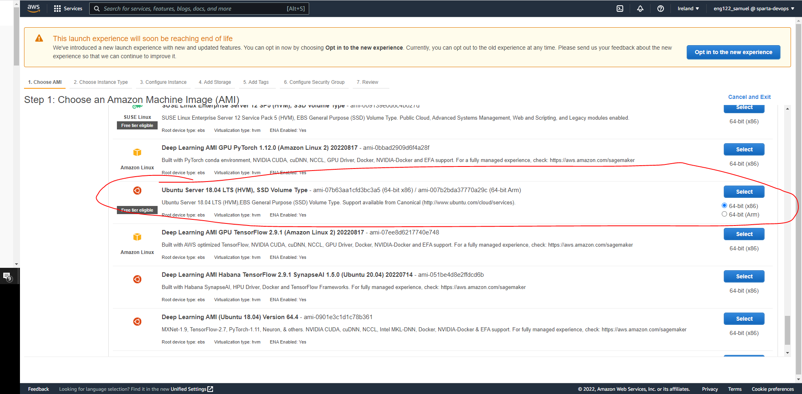

# Cloud Computing


### Things to Consider when Looking at Creating a Remote VM

- Processing power
- OS 
- Storage
- Power Supply
- Cost

The uses of the VM must be considered when selecting specifications as limiting cost is relevant.

## How to Setup AWS Application

### 1. Create a VM on AWS

1. Select the Operating System


2. Select the Processing Power


3. Configure instance details


4. Select the storage


5. Attach tags


6. Select which ports should be allowed to interact with the VM


### 2. SSH Connect to VM


- In the location of the key enter the command at the bottom to SSH into the VM
 
### 3. Install dependencies

```
# updates ubuntu
sudo apt-get update
sudo apt-get upgrade -y

# nginx install
sudo apt-get install nginx -y
sudo systemctl enable nginx
sudo systemctl start nginx

# nodejs install
sudo apt-get purge nodejs npm
curl -sL https://deb.nodesource.com/setup_6.x | sudo -E bash -
sudo apt-get install -y nodejs
sudo apt-get install -y npm

# pm2 install
sudo npm install pm2 -g
```

### 4. Copy files from Local Host to Remote Host

- SCP Command (used to migrate from lh to gh) `scp -i [key_name] -r [file_source] [file_destination] ` 
- The file destination is formatted as @user:PUBLIC_DNS so in this example it uses `ubuntu@ec2-34-240-115-36.eu-west-1.compute.amazonaws.com`

### 5. Reconfigure NGINX to allow reverse proxy

1. `sudo nano /etc/nginx/sites-available/default`
2. Reconfigure the file as such
```
server {
        listen 80 default_server;
        listen [::]:80 default_server;

        root /var/www/html;

        
        index index.html index.htm index.nginx-debian.html;

        server_name _;

        location / {
                proxy_pass http://localhost:3000;
        }

}
```
3. `sudo systemctl restart nginx`

### 6. Run NPM start and the app should be working
- Using the public IP address found,

- The app should now be working


